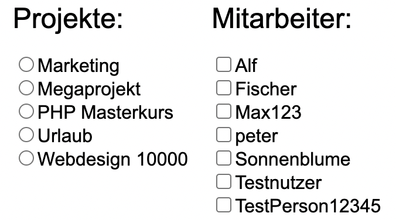

= Projektdurchführung

// ist das ein problem einer konkreten iteration oder soll das so generell stehen bleiben?
// == Einführung

// Zu Beginn des Semesters haben wir uns zusammengesetzt und das weitere Vorgehen im Modul SE II besprochen. Nach relativ kurzer Zeit stellte sich heraus, dass wir ein wenig Unterstützung gebrauchen könnten. Nachdem wir von der Möglichkeit erfuhren ein neues Teammitglied aufzunehmen, fiel die Entscheidung recht schnell und wir meldeten uns bei Herr Prof. Anke. Nach einer Einarbeitungszeit von etwa 2 Wochen konnte das neue Teammitglied erfolgreich integriert werden und seine Aufgaben selbstständig erfüllen.

== Iteration 9 (23.03.2022 - 28.03.2022)

Dies war die erste Iteration im neuen Semester. Wir hatten aufgrund der Semesterferien fast 2 Monate nicht mehr an dem Projekt gearbeitet. Daher mussten wir uns erst einmal wieder einen Überblick über den aktuellen Stand verschaffen und unsere Fähigkeiten aus dem Winterschlaf holen. 

Frau Rubein hat das Projekt verlassen, da Sie Software Engineering II nicht mehr belegt.

Nicht passend dafür war der krankheitsbedingte Ausfall von Herrn Keil und Frau Tartz, diese sollen noch weitere Wochen ausfallen. 

Unsere Ziele für I09 waren:

* Anlegen der Abteilungstabelle + 5 Abteilungen #34
* Nutzerübersichtsseite #39
* Datenbanktabelle für Beziehung zwischen Projekt und Benutzer #38
* Mitarbeiter anlegen um Abteilungsdropdown erweitern #35 
* Aufräumen der Datenbankenstruktur #37
* Anlegen der Abteilungstabelle + 5 Abteilungen #34
* Mitarbeiter hinzufügen check der E-Mail #33
* Mitarbeiter hinzufügen Passwortkriterien #36
* Beleg korrigieren #29

=== Dokumentation

Wie bereits geschrieben, hat Herr Professor Anke unseren abgegeben Beleg über die Semesterferien korrigiert. Auch wenn es nicht viele Fehler gab, mussten diese natürlich korrigiert werden. 
Viele der Fehler waren nur Kleinigkeiten und diese konnten schnell behoben werden.

Die schwerwiegenderen Fehler waren die komplett falsche "logische Sicht". Dort wurde ein C4-Modell erwartet, welches wir jedoch nicht hatten. Daher musste dieses von Grund auf neu erstellt werden. Da das Back-End zu dem Zeitpunkt noch nicht komplett fertig war, wurden erst einmal die beiden oberen Sichten angefertigt. Weitere Komponenten sollten im weiteren Verlauf des Projektes folgen. 

Zudem fehlte der komplette Abschnitt "Praktiken und Bewertung". Diese Aufgabe war nicht unbedingt schwierig, jedoch hatten wir uns bereits viel für diese Iteration vorgenommen und mussten daher diesen Abschnitt auf die nächste Iteration verschieben.

=== Implementation

*UC 2*

Die Datenbankstruktur musste erweitert werden, damit der Status basierend den Projekten der Nutzer zugeteilt werden kann. Um Projekten mehrere Nutzer zuzuweisen zu können und auch den Nutzern verschiedene Projekte zuzuweisen zu können, wurde eine neue Datenbanktabelle erstellt, die diese m:n Beziehung auflöst. Diese Aufgabe wurde Herrn Kirchhoff zugeteilt und konnte in dieser Iteration nicht beendet werden. (#38)

*UC 3*

Eine Aktualisierung betraf die Möglichkeit, bei der Registrierung, nun jedem Benutzer eine Abteilung zuzuordnen.
Dazu wurde zunächst eine neue Datenbanktabelle Abteilung von Herrn Beck angelegt. (#34)

Die Auswahl der Abteilung bei Registrierung eines neuen Nutzers wurde auf die nächste Iteration verschoben. (#35)

Herr Liebert wollte eine Übersicht über einen Benutzer haben, wenn dieser in der Kalenderübersicht angeklickt wird. Dort sollte Name, Abteilung und Lösch- sowie Bearbeitungsmöglichkeiten des Benutzers angezeigt werden. Zunächst wird hier nur der Name des Benutzers angezeigt. Weitere Werte müssen in der nächsten Iteration hinzugefügt werden. Diese wurde von Herrn Werner bearbeitet. (#39)
//bild einfügen

Wenn ein neuer Benutzer angelegt wird, soll überprüft werden, ob es sich um eine valide E-Mail Adresse handelt. Diese Aufgabe wurde Herrn Tichonow zugeteilt. Dies konnte nur im Front-End fertiggestellt werden. Die Überprüfung im Back-End wird auf die nächste Iteration verschoben. (#33)

Ebenso soll das verwendete Passwort minimalen Sicherheitsstandards entsprechen. Diese Aufgabe wurden ebenfalls Herrn Tichonow zugeteilt. Da diese Validierungen nicht nur Frontend-seitig überprüft werden sollten, sondern auch im Backend, konnte dieses Issue nicht in dieser Iteration beendet werden. (#36)

=== Problem

Zu diesem Zeitpunkt fehlten Herr Keil und Frau Tartz bei dem wöchentlichen Teammeeting unentschuldigt. Wir entschieden uns noch keine "Maßnahmen" zu treffen, da dies auch einfach eine normale Krankheit bzw. anderweitige terminliche Schwierigkeit sein konnte. Einige Aufgaben konnten nicht abgeschlossen werden.

=== Entscheidungen

Herr Kemter hat sich bereit erklärt als Teamleiter zu fungieren, da Frau Rubein diese Rolle zuvor inne hatte.

== Iteration 10 (29.03.2022 - 04.04.2022)

Unsere Ziele für I10 waren: 

Neue Ziele:

* Suche implementieren #28
* Mehr Dummy-Daten für Project und Project_User #42
* Verbessern (Refactoring) des bestehenden Codes

Fortgeführt: 

* Beleg korrigieren #29
* Mitarbeiter hinzufügen check der E-Mail #33
* Mitarbeiter anlegen um Abteilungsdropdown erweitern #35 
* Mitarbeiter hinzufügen Passwortkriterien #36
* Datenbanktabelle für Beziehung zwischen Projekt und Benutzer #38
* Nutzerübersichtsseite #39

=== Dokumentation

Herr Kemter hat das Architecture Notebook und das in der letzten Iteration angefangene C4-Modell verbessert und die Projektrollen besser formatiert. Das Glossar wurde erweitert und neue Praktiken im Projekt-Plan eingefügt. (#29)

=== Implementation

*UC 3*

Die Nutzerübersichtsseite wurde von Herrn Werner um die Anzeige der Abteilung des Nutzers erweitert und das Issue somit abgeschlossen. (#39)

Herr Werner hat das Aussehen der Benutzererstellung leicht verbessert. Der Code von einigen CSS, JavaScript und PHP Dateien wurde refactored. Jenes sollte dafür dienen, dass das spätere Bearbeiten vereinfacht wird.
Außerdem wurden die PHP-Credentials angepasst.

Die Datenbanktabelle um Projektmitgliedschaften darzustellen wurde von Herrn Kirchhoff fertiggestellt. (#38)

Die Auswahl der Abteilung während der Nutzererstellung wurde von Herrn Beck beendet. (#35)

Die Passwortkriterien, sowie die Überprüfung der E-Mail Adresse, werden weiterhin von Herrn Tichonow bearbeitet. (#33 & #36)

Es sollten Dummy-Daten für Projekte eingefügt, damit die Funktionalität leichter überprüft werden kann und das spätere Arbeiten dadurch angenehmer gestaltet werden kann. Jedoch wurde dies nicht begonnen und wird daher in der nächsten Iteration angefangen. (#42)

Es sollte eine Suchfunktion eingefügt werden, sodass nach Benutzern und Projekten gesucht werden kann. Dies wurde von Herrn Liebert gewünscht, aber ist kein essentiell wichtiges Feature, da andere Use Cases laut ihm wichtiger sind. Es ist unklar wann Herr Keil wieder an dem Projekt mitarbeiten kann und deswegen wurde ihm diese Aufgabe zugeteilt. Sie wurde bis zum Ende der Iteration nicht begonnen. (#28)

== Problem

Einige der bereits für die letzte Iteration vergebenen Aufgaben sind immer noch nicht abgeschlossen. Jedoch haben wir die Hoffnung, dass dies in der nächsten Iteration besser wird.

== Iteraion 11 (05.04.2022 - 11.04.2022)

Unsere Ziele für I11 waren: 

Neue Ziele:

* Erstellen des Status soll nur noch mit einem gültigen Projektnamen funktionieren #30
* Projekterstellungsseite Frontend+Backend #32

Fortgeführt:

* Suche implementieren #28
* Beleg korrigieren #29
* Mitarbeiter hinzufügen Passwortkriterien #36
* Mitarbeiter hinzufügen check der E-Mail #33
* Mehr Dummy-Daten für Project und Project_User #42

=== Dokumentation

Die restlichen Fehler bzw. Ungenauigkeiten des Belegs konnten behoben werden. Dazu zählten Praktiken und Bewertung, sowie die ersten beiden Schichten des C4-Modell. Eine genauere Darstellung war noch nicht möglich, da die ganzen Komponenten erst im Laufe des Projektes erstellt werden. (#28)

=== Implementation

*UC 2*

Wenn auf einen Wochentag geklickt wird, dann wird nun ein Dropdown-Menü angezeigt. In diesem werden nur die Projekte angezeigt, in welchen der Nutzer aus der jeweiligen Zeile ein Mitglied ist. Dies wurde von Herrn Werner implementiert. (#30)

*UC 3*

Eine Funktion zum Anzeigen des Passworts wurde von Herrn Tichonow implementiert. Die Überprüfung des Passwortes und der E-Mail Adresse im Back-End fehlt weiterhin. (#33 & #36)

*UC 4*

Die Projekterstellungsseite wurde nicht angefangen. Die Weiterleitung zu dieser von der Wochenansicht ist jedoch fertig. Dies wurde von Herrn Beck bearbeitet. (#32)

Die Dummy Daten für die Projekte wurden immer noch nicht angefangen. (#42)

=== Problem 

Es zeichnete sich ab, dass neben dem Fernbleiben von Herrn Keil und Frau Tartz auch einige andere Teammitglieder eine nur geringe Beteiligung vorweisen konnten. Dieser Umstand wurde im Teammeeting thematisiert und um Besserung gebeten, aber aufgrund fehlender Dringlichkeit (wie wir zu dem Zeitpunkt dachten) wurde von weiteren Maßnahmen abgesehen. 

== Iteration 12 (12.04.2022 - 25.04.2022)

In dieser Iteration haben wir mit Herrn Nguyen, welcher bereits Erfahrung in der Front-End und Back-End Entwicklung mitbringt, Verstärkung erhalten. Mit seinem Wissen konnte er bei der Implementierung sofort mithelfen und Herrn Werner entlasten, der bisher viel aushelfen musste bei den vergebenen Aufgaben zur Implementation. Die Teammoral wurde dadurch erheblich verbessert und die Entwicklung hat wieder etwas mehr Fahrt aufgenommen.

Neue Ziele: 

* Projekterstellungsseite Frontend+Backend #32
* API: Aktuelle Kalenderwoche #43
* API: Alle Projekte in denen ein Nutzer ein Mitglied ist
* Projektverwaltungsseite #45     
* Neues Mitglied Herr Nguyen einführen

Fortgeführt:

* Projekterstellungsseite Frontend+Backend #32
* Dokumentation aktuell halten bzw. weiterbearbeiten
* Mehr Dummy-Daten für Project und Project_User #42
* Mitarbeiter hinzufügen Passwortkriterien #36
* Mitarbeiter hinzufügen check der E-Mail #33

=== Dokumentation

Unser neues Mitglied Herr Nguyen wurde in die Dokumentation eingetragen und ihm wurden die betroffenen Dateien gezeigt und einige Empfehlungen im Umgang mit AsciiDoc ausgesprochen.

Die Risikoliste wurde entsprechend der in Problem genannten Sachlage erweitert. 

=== Implementation
*UC 1*

Eine neue Schnittstelle wurde eingefügt, welche die aktuelle Kalenderwoche mit den Daten aller Wochentage ausgibt. (#43)
Dies ist zentral, um dem Nutzer mehr als die aktuelle Woche anzeigen zu können. Dies ist auch notwendig, um einen Nutzerstatus in einer beliebigen Kalenderwoche hinzufügen zu können. Dies wurde von Herrn Nguyen bearbeitet.

*UC 2*

Eine neue Schnittstelle ermöglicht es alle Projekte zu erhalten, in welchem ein Nutzer ist. Dies ist notwendig, um dem Nutzer nur einen Status bzw. Arbeitsauftrag für Projekte zu vergeben an welchen dieser auch teilnimmt. Dies wurde von Herrn Werner bearbeitet.

*UC 3*

Die Überprüfung des Passwortes und der E-Mail Adresse im Back-End fehlt weiterhin. Herr Tichonow hat Verbesserung an der bestehenden Front-End Überprüfung vorgenommen, indem neue required Attribute und Placeholder eingefügt wurden. (#33 & #36)

*UC 4*

Da die Benutzerverwaltung(UC 3) schon sehr weit fortgeschritten ist, konzentrieren wir uns nun verstärkt auf die Projektverwaltung. Jedes Projekt soll einen Namen, einen Projektverantwortlichen, ein Enddatum (welches zur Orientierung dienen soll), eine Beschreibung und einen Farbcode beinhalten, welcher später in der Kalenderansicht sichtbar sein kann.

Zunächst hat Herr Beck dafür eine neue Unterseite implementiert, in der neue Projekte angelegt werden. (#32) Das Verwalten aller bestehenden Projekte soll in der nächsten Iteration angefangen werden. Ebenso soll es möglich sein jedem Projekt beliebig viele Benutzer zuzuweisen. (#45)

Die Dummy-Daten, welche von Herrn Kirchhoff erstellt werden sollten, wurden nicht eingefügt und das Issue wird in die nächste Woche verschoben. (#42)

=== Entscheidung 

Um die Produktivität einzelner Teammitglieder zu erhöhen wurde die Iterationszeit auf 2 Wochen erhöht. Dadurch werden die Meetings ebenfalls aller zwei Wochen stattfinden. Wir erhoffen dadurch, dass so mehr Zeit für das Bearbeiten der Aufgaben übrig bleibt.
Diese Entscheidung wurde getroffen bevor Herr Nguyen unser Team verstärkt hat.

Es wurde noch einmal betont, dass bei Programmier-Problemen jederzeit Herr Nguyen oder Herr Werner um Rat gefragt werden kann und Probleme nicht erst am Ende einer Iteration aufgeworfen werden sollen.

Herr Keil's Aufgabe wurde nicht neu vergeben, da wir merkten, dass die Suchfunktion nicht sehr wichtig war und wir die Kräfte mehr bündeln mussten, um an anderen Stellen mit wichtigeren Funktionen Fortschritt zu erzielen. 

Außerdem haben wir uns mit Herrn Zirkelbach getroffen und ein paar Kleinigkeiten erfragt (z.B. zu dem korrigierten Beleg) und unseren Fortschritt mit der Anwendung gezeigt. 

=== Problem 

Die bisher teilweise bemängelte Produktivität verbesserte sich im Gesamtbild spürbar, auch wenn das nicht auf jedes einzelne Teammitglied zurückgeführt werden konnte.

Es ist unklar, wieso die Überprüfung des Passwortes und der E-Mail Adresse bzw. das Einfügen von Dummy-Daten in die Datenbank bereits seit mehreren Iterationen erfolglos von Herrn Tichonow und Herrn Kirchhoff bearbeitet wird. Verschiedene Hilfestellungen in Form von Websites, Tutorials oder das Angebot, jederzeit bei einem Gruppenmitglied um Hilfe fragen zu können, wurden gegeben.

Wie bereits in den anderen Iterationen beschrieben, waren Frau Tartz und Herr Keil immer noch krank. Auf Nachfrage antworteten beide, dass sie noch länger ausfallen würden.

== Iteration 13 (26.04.2022 - 09.05.2022)

Unsere Ziele für I13 waren: 

Neue Ziele:

* Dummy Status einfügen #48
* API: Status der Kalenderwoche #49
* API: Erweiterung um das Jahr #50
* API: Einfügen eines neuen Status #52
* API: Alle Nutzer eines Projektes #53
* API: REST-API zum Einfügen, Löschen und Abrufen von Nutzern in Projekten #54

Fortgeführt: 

* Mehr Dummy-Daten für Project und Project_User #42
* Projektverwaltungsseite #45
* Mitarbeiter hinzufügen Passwortkriterien #36
* Mitarbeiter hinzufügen check der E-Mail #33

=== Dokumentation 

Die Risikoliste wurde erneut um einen Eintrag erweitert. Herr Nguyen hatte ein neues Formatierungstool verwendet, was ihm eigentlich Arbeit abnehmen sollte. Jedoch stellte sich heraus, dass bei jedem Speichern die Leerzeichen, welche zum Einrücken verwendet wurden, durch Tabs ersetzt. Dies führte dazu, dass bei Github die tatsächlichen Änderungen schwer zu sehen waren und es sehr viele Merge Konflikte gab.

=== Implementation

*UC 1*

Die Funktionen zum Einfügen eines neuen Status, dem Anzeigen eines neuen Projektes, sowie das Einfügen, Löschen und Abrufen von Nutzern in einem Projekt wurden fertiggestellt und getestet, jedoch noch nicht an das Front-End angebunden. Dies wurde von Herrn Nguyen und Herrn Werner bearbeitet. (#52, #53 & #54)

Während der Entwicklung stellte sich heraus, dass das ständige Erstellen von Status zu Testzwecken redundante Arbeit war. Um den Workflow zu erleichtern wurden Dummy-Status eingefügt und die Dummy-Projekte aus der letzten Iteration wurden fertiggestellt. Dies wurde von Herrn Kirchhoff bearbeitet. (#48 & #42)

*UC 3*

Das Überprüfen der E-Mail Adresse und des Passwortes im Back-End wurde von Herrn Tichonow fertiggestellt. (#33 & #36)

*UC 4*

Die Projektverwaltungsseite konnte von Herrn Beck größtenteils fertiggestellt werden.
Es werden nun alle Projekte angezeigt und die dazugehörigen Nutzer. Es gibt noch einige Kleinigkeiten, die das Bedienen unhandlich machen und dies wird von Herrn Beck in der nächsten Iteration bearbeitet.

=== Entscheidung

Aufgrund des beschriebenen Problems mit dem Formatierungstool bei Herrn Nguyen wurde beschlossen, das Tool nicht mehr zu verwenden und es wurde sich auf eine einheitliche Formatierung geeinigt. 

Die Erhöhung der Iterationszeit auf zwei Wochen führte nicht zu der erwünschten Verbesserung, sondern zu einer weiteren Verschlechterung der Produktivität. Daher wurde entschieden, die folgenden Interationen wieder auf eine Woche zu verkürzen.

=== Problem 

Bisher ist eine Verbesserung hinsichtlich der Produktivität noch ausbaufähig, auch wenn sie durch Herr Nguyen gesteigert werden konnte.

Herr Keil und Frau Tartz haben sich nach wie vor nicht an dem Projekt beteiligt und das Team auch weiterhin nicht über den aktuellen Stand selbstständig in Kenntnis gesetzt. Daher war es Herr Kemters Aufgabe diese Informationen einzuholen.

Frau Tartz teilte mit, dass sie auf dem Weg der Besserung sei und sich in Zukunft wieder an dem Projekt beteiligen werde.

Leider war festzustellen, dass Herr Keil weiterhin gesundheitlich bedingt verhindert war. Daher musste das Team auf ihn weiterhin verzichten. Des weiteren wurde Herr Professor Anke über diese Situation in Kenntnis gesetzt.

=== Iteration 14 (10.05.2022 - 16.05.2022)

Unsere Ziele für I14 waren:

Neue Ziele:  

* Status anzeigen #51
* Statische Code-Analyse mit Psalm
* Verbleibende Fehler von Psalm beheben #58
* Dummy Daten für Status falsche Wochentage #61
* Manuelle Qualitätsprüfung #65

Fortgeführt:

* API: Einfügen eines neuen Status #52

=== Implementation

*UC 1*

Das Anzeigen der Status anhand der eingetragenen Status in der Datenbank sollte von Herrn Nguyen bearbeitet werden, jedoch mussten dazu noch einige Erweiterungen der bestehenden Schnittstellen vorgenommen werden (#52), weswegen dies nur teilweise fertiggestellt werden konnte. (#51)

Bei den eingefügten Dummy-Daten der Status, welches in der letzten Iteration abgeschlossen wurde, gab es einen Fehler. Dieser wurde von Herrn Kirchhoff in Unterstützung von Herrn Werner behoben.

*Psalm*

Mit Psalm hat Herrn Werner ein neues Tool eingefügt, welche eine statische Code-Analyse des PHP Codes vornimmt. Dies soll genutzt werden, damit weniger Zeit mit Code-Reviews verloren geht und häufige Probleme automatisch erkannt werden. Herrn Kirchhoff Aufgabe war es nun alle erkannten Probleme durch Psalm zu beheben. (#58)

=== Qualitätssicherung

Frau Tartz hat eine manuelle Überprüfung sämtlicher Funktionalitäten vorgenommen und hat dabei einen Fehler bei der Projekterstellung gefunden, welcher von Herrn Werner behoben wurde. (#65)

=== Entscheidung

Wir hatten schon länger kein Meeting mit unserem Themensteller Herrn Liebert. Dies hatte den Grund, dass wir die geforderten Use-Cases noch nicht umgesetzt hatten und wir erst mehr Fortschritt erzielen wollten. Ein Monat vor Projektübergabe und mit voranschreitenden Funktionen entschieden wir uns ein Meeting mit ihm auszumachen. Außerdem sollte besprochen werden, wie die Übergabe und das Installieren der Anwendung bei T-System MMS stattfinden soll. Das Meeting soll in der folgenden Woche stattfinden.

Nachdem wir feststellten, dass das Arbeiten auf einer Branch zu häufigeren Merge-Konflikten führte und viele Bugs eingeschleust wurden, beschlossen wir unsere Arbeitsweise zu ändern. Das committen auf dem Hauptbranch ist ab sofort für alle Teammitglieder gesperrt und es wird nun mit Feature Branches und Pull Requests gearbeitet. Jeder Pull Request muss von einem Teammitglied genehmigt werden, bevor dieser gemerget werden kann. Auch gibt es nun eine statische Code-Analyse mit Psalm, welche bei jedem Pull Request ausgeführt wird. Dies vereinfachte die Qualitätssicherung und die Kommunikation über mögliche Verbesserungen.

Da immer weniger an der Dokumentation zu erledigen war, wurde Herr Kemter in HTML und CSS fortgebildet, um bei späteren Aufgaben zu helfen.

== Iteration 15 (17.05.2022 - 23.5.2022)

Unsere Ziele für I15 waren: 

Neue Ziele:

* Wechsel der Wochenansicht #66
* Bug: Falsche Kalenderwoche + Datum wird angezeigt #69
* CSS: Projektverwaltung #70
* Psalm Integration verbessert
* Statische Code-Analyse mit ESLint

Fortgeführt:
 
* Verbesserungen der Projektverwaltung
* Erweiterung der Risikoliste
* Verbleibende Fehler von Psalm beheben #58

=== Dokumentation 

Die Probleme mit Git, weswegen wir seit der letzten Iteration nun Feature-Branches verwenden, wurden in die Risiko-Liste aufgenommen. Ebenfalls wurde einige Korrekturen an der Dokumentation vorgenommen von Herrn Kemter.

=== Feedback vom Themensteller

Herr Liebert ist zufrieden mit unserem Fortschritt. 
Er forderte, dass nach der Erstellung eines Benutzers oder eines Projektes eine Bestätigung der Aktivität angezeigt werden und die Seite wieder zurück auf die Kalenderansicht wechseln soll. Außerdem merkte er an, dass das Design noch verbessert werden sollte. Diese Anmerkungen setzten wir als Issues für die kommenden Iterationen an.

Die Projekt-Übergabe wurde auf den 22.06.2022 festgelegt. 

Herr Liebert möchte nicht, dass wir die Anwendung vor der Übergabe auf den Systemen von T-System MMS testen, da er davon überzeugt ist, dass aufgrund der Nutzung von Docker es keine Probleme geben wird. Wir teilen diese Meinung nur bedingt und wären lieber besser auf alle Eventualitäten vorbereitet. Wir werden versuchen ihn zu einem späteren noch einmal darauf anzusprechen und dies auch schriftlich festhalten. 

=== Implementation

*UC 1*

Für den Use Case 01 fehlte noch ein elementares Feature. Das Wechseln der Kalenderwoche. Dieses Feature wurde in dieser Iteration von Herrn Nguyen angefangen, da nun alle nötigen Schnittstellen dafür fertig sind. Dabei kam ein Problem auf, welches aber erst am Ender der Iteration nämlich an einem Montag ersichtlich wurde. Nach gründlicher Untersuchung stellte sich heraus, dass es an der falschen Einstellung der Zeitzone lag. Nutzte man also Montag morgen das Programm, wurde dem Nutzer immer noch die letzte Kalenderwoche angezeigt. Das Problem konnte behoben werden. (#66 & #69)

*ESLint*

Die statische Code-Analyse mit Psalm war sehr erfolgreich und deswegen wurde von Herrn Werner nun ebenfalls eine statische Code-Analyse für den Javascript Code eingefügt. Dazu wird ESLint verwendet. Beide Code-Analysen laufen automatisch bei jedem Pull Request durch.

*Psalm*

Herr Kirchhoff konnte weitere von Psalm gemeldete Fehler beheben.

*Design*

Die geforderten Designverbesserungen wurden von Herrn Kemter begonnen. Das Ziel war eine optimierte Darstellung der Inhalte. Zuvor wurden diese zum Teil hochkant dargestellt. Außerdem sollte die Lesbarkeit verbessert und dem Benutzer ein verbessertes Feedback gegeben werden, was anklickbar ist. Die Verbesserungen betroffen vor allem die Projektverwaltung. (#70)

=== Probleme

Frau Tartz hat sich diese Woche, nach der Qualitätsprüfung in der letzten Iteration, wieder nicht an dem Projekt beteiligt.
Herr Tichonow und Herr Beck konnten in dieser Iteration leider nichts beitragen.
Herr Keil ist immer noch verhindert und es ist unklar, ob dieser noch an dem Projekt mitarbeiten wird.

== Iteration 16 (24.05.2022 - 30.05.2022)

Unsere Ziele für I16 waren: 

Neue Ziele: 

* Duplizierte gleiche Status verhindern
* Status Schnittstelle um Jahr erweitern
* Projekt erstellen Fehlerbehandlung #68
* Datenbankenstruktur: Bei Status den Primary Key ersetzen #63

Fortgeführt: 

* CSS: Projektverwaltung #70
* Wechsel der Wochenansicht #66
* Verbleibende Fehler von Psalm beheben #58

=== Implementation

*UC 1*

Die Status Schnittstelle wurde um einen Parameter für das Jahr erweitert. Nun ist es möglich auch auf Kalenderwochen, aus einem anderem Jahr, als dem aktuellen zuzugreifen. Dies wurde von Herrn Nguyen und Herrn Werner bearbeitet.

Ebenfalls wurden die Primärschlüssel-Attribute der Datenbanktabelle Status so angepasst, dass kein Status mit dem gleichen Nutzer, Tag und Projekt erstellt werden kann. Dafür wird ein sogenannter 'Composite Primary Key' verwendet. Dies wurde von Herrn Nguyen bearbeitet.

*UC 4*

Bei der Projekterstellung fehlte noch die Validierung der Nutzerdaten im Back-End, dies wurde von Herrn Beck und Herrn Werner ausgebessert.

*Design*

Herr Kemter hat sich weiterhin mit Design-Verbesserungen beschäftigt und konnte die Projektverwaltung deutlich übersichtlicher gestalten.

=== Entscheidung

Herr Keil konnte sich leider noch nicht an dem Projekt beteiligen. Daher haben wir entschieden diesen Sachverhalt nochmal Herrn Professor Anke darzulegen und ihm mitzuteilen, dass wir gegen eine Benotung von Herrn Keil sind. Wir begründeten diese Entscheidung damit, dass er keine Chance mehr hatte einen angemessenen Arbeitsanteil zu leisten. Von Herrn Professor Anke erfuhren wir, dass sich Herr Keil bereits in der Woche zuvor selbstständig abgemeldet hatte.

Hinsichtlich der weiterhin unterschiedlichen Beteiligung einiger Teammitglieder, wurde sich für eine differenzierte Bewertung ausgesprochen. Wie extrem unsere Empfehlungen dafür ausfallen werden, sollte daran bemessen werden wie diese Teammitglieder in den restlichen Wochen sich am Projekt beteiligen werden.

=== Probleme

Leider konnten Frau Tartz, Herr Tichonow und Herr Kirchhoff in dieser Iteration keinen Beitrag leisten.

== Iteration 17 (31.05.2022 - 06.06.2022)

Unsere Ziele für I17 waren:

Neue Ziele:
* Projektverwaltung: Neues Projekt anlegen Erfolgsmeldung #83 
* Lizenz für Projekt erarbeiten #84
* Benutzerverwaltung: Neuen Benutzer anlegen Erfolgsmeldung #86
* Projektverwaltung: Projekte löschen #94

Fortgeführt: 

* Verbleibende Fehler von Psalm beheben #58

=== Implementation

*UC3 & UC4*

Beim Testen der Anwendung ist uns aufgefallen, dass es keine eindeutige Rückmeldung über den Erfolg oder den Misserfolg beim Erstellen eines neuen Benutzers oder Projektes gibt und dies wurde von Herrn Liebert gefordert. Herr Werner hat dies bearbeitet. (#83 & #86)

*UC4*

Ein neues Feature zum Löschen von Projekten wurde von Herrn Nguyen angefangen zu bearbeiten. Die Arbeiten an diesem Issue wurden diese Iteration jedoch nicht finalisiert. (#94)

Einige Fehler, im Zusammenhang mit der Auswahl des Projektverantwortlichen, wurden bei der Projekterstellung von Herrn Beck behoben.

*Psalm*

Die verbleibenden Psalm Fehler wurden von Herrn Kirchhoff behoben.

*Sonstiges*

Einige Formattierungsfehler und Fragmente von nicht korrekt gelösten Merge-Conflicts wurden von Herrn Werner bereinigt.

=== Probleme

Leider konnten Frau Tartz und Herr Tichonow in dieser Iteration keinen Beitrag leisten.

== Iteration 18 (09.06.2022 - 13.06.2022)

Aufgrund des Feiertags (Pfingstmontag) fand unser Teammeeting und Iteration von Mittwoch bis Montag und nicht wie üblich von Montag bis Montag statt.

Unsere Ziele für I17 waren: 

Neue Ziele:

* Login einfügen #91
* Fix: Replace is_int with ctype_digit #96
* Mitarbeiteransicht: Löschen Funktionalität #103
* Testdokumentation #105
* Betriebsdokumentation #106
* Entwicklerdokumentation #107

Fortgeführt: 

* Projektverwaltung: Neues Projekt anlegen Erfolgsmeldung #83 
* Wochenansicht: Löschen eines Status #98
* CSS: Design verbessern #102
* Projektverwaltung: Projekte löschen #94

=== Dokumentation

Herr Kemter begann den "Durchführungs"-Teil des Projektberichtes. Hier gab es die "Schwierigkeit", welchen genauen Aufbau es geben soll. Hier stellten die von Herrn Professor bereitgestellten Beispiele eine gute Grundlage. Schlussendlich entschied er sich für eine Nennung der neuen und fortgeführten Issues. Ob dies noch einmal geändert wird steht noch offen. Weiterhin wird er in einzelnen Abschnitten die Implementation, Entscheidungen, Probleme und eventuelle weitere Themen beschreiben.

Da bei vielen Mitgliedern die Lust auf das Projekt aus verschiedenen Gründen gesunken ist, hat Herr Kemter die Risikoliste um einen entsprechenden Eintrag erweitert. 

Die Betriebsdokumentation wurde angefangen von Herrn Tichonow bearbeitet zu werden. Herr Kirchhoff hat mit der Testdokumentation basierend auf die bestehenden Tests angefangen. Die Entwicklerdokumentation wurde von Herrn Beck in Zusammenarbeit mit Herrn Kemter angefangen.

=== Implementation

*UC1* 

Nachdem Herr Kemter bereits das Design deutlich verbessert hat und wir einige Tipps und Beispiele vom Themenersteller bekommen haben, setzte Herr Nguyen die Bearbeitung der Darstellung des Projektes fort. Zunächst wurden die Border der Tabelle durch einen gestreiften Hintergrund gewechselt und die Buttons, sowie die Farben denen der T-System MMS angeglichen. Außerdem wurde eine neue Schriftart verwendet. (#102)

*UC3*

Das Use-Case 3 wurde um die Funktion zum Löschen eines Benutzers erweitert. (#103) Bei der Implementierung stellte sich heraus, dass geklärt werden muss, wie mit Projektleitern umgegangen wird. Also ob auch alle Projekte und Status, die mit dem gelöschten Benutzer in Verbindung standen ebenfalls gelöscht werden. Sollten die Projekte gelöscht werden, müsste man auch alle Status mit diesem Projekt löschen. Letzten Endes entschieden wir uns dazu, dass der Benutzer und das Projekt separat gelöscht werden müssen, um die Komplexität gering zu halten. Das löschen von Projekten konnte noch nicht ganz abgeschlossen werden.
Außerdem wurde das Programm um die Login-Funktionalität erweitert um unbefugten Zugriff zu verhindern. Ist der Nutzer nicht angemeldet, so wird er auf die Login-Seite weitergeleitet und zum Login aufgefordert. (#91)

Nach Erstellung eines neuen Projektes wird der Nutzer nun nicht mehr auf die Wochenansicht weitergeleitet, sondern zurück zur Projektverwaltung. Ebenfalls wird die Erfolgsmeldung auf der Projektverwaltungsseite mit angezeigt. Dies wurde von Herrn Werner bearbeitet. (#83)

=== Problem und Entscheidung

Das Teammeeting fand aufgrund von kurzfristigen Absagen bloß mit drei Personen statt. Aufgrund der Anwenderabgabe und Dokumentation in zwei Wochen entschieden wir, dass Programmier-Aufgaben bloß noch bis zum folgenden Montag erledigt werden. Die restliche Zeit bis zur Abgabe sollte dann für Qualitätssicherung, Dokumentation und andere Dokumente verwendet werden. 

Da noch nicht alle wichtigen Features, die durch Herrn Liebert gefordert wurden, zum Meeting abgeschlossen waren, sollten diese zuerst erledigt werden. Wir haben nun eine Priorisierung der Issues eingeführt, um zumindest die wichtigsten Features noch zu schaffen. Wenn mehr geschafft wird, dann kann noch mehr erledigt werden.

Herr Kemter hat sich wegen des Projektberichts nochmal mit Herrn Zirkelbach unterhalten. Dabei kam auch unsere Entscheidung zu sprechen und das zumindest einige Teammitglieder mit dem Endergebnis und der Arbeitsweise unzufrieden sind.
Herr Zirkelbach empfiehl Herr Kemter, dass die Programmieraufgaben bloß noch von Herrn Werner und Herrn Nguyen erfüllt werden und die anderen Personen bloß Dokumentieren sollen. Dieser Empfehlung folgten wir.

Auch wenn Herr Kemter das Design und Aufbau der einzelnen Seiten verbessert hatte, waren wir noch nicht zufrieden. Daher hat Herr Nguyen diese nochmal verbessert und sich dabei am Corporate Design von T-System MMS orientiert, damit sich unsere Anwendung dieser ähnelt.

=== Iteration 19 (14.6.2022 - 20.06.2022)
Unsere Ziele für I19 waren: 

Neue Ziele: 

* Anwenderdokumentation #124
* Implementation finalisieren

Fortgeführt:

* Projektverwaltung: Projekte löschen #94
* Testdokumentation #105
* Betriebsdokumentation #106
* Entwicklerdokumentation #107
* Projektbericht #116

=== Dokumentation 

Durch die Entscheidung aus der vorherigen Iteration wurde diese Iteration hauptsächlich an den Dokumenten gearbeitet. Diese umfassten das Besichtigen und das Verbessern der Test-, Betriebs- und Entwicklerdokumentation. Die Aufteilung an den einzelnen Dokumenten bleibt wie letzte Iteration.

Die Anwenderdokumentation sollte auch erledigt werden, jedoch wussten wir nicht, ob eventuell noch kleine Verbesserungen realisiert werden, was einige Teile der Anwenderdokumentation verändern würde. Wir haben mit Herrn Liebert vereinbart, dass wir sie nicht zusammen mit der Anwendung übergeben müssen. Es reicht auch, wenn sie ihm bis spätestens 8. Juli geschickt wird. Die Anwenderdokumentation wird von von Frau Tartz bearbeitet.

Einzelne Use Cases wurden um Kleinigkeiten verbessert.

=== Implementation

Es wurden keine neuen Features mehr angefangen. Herr Nguyen und Herr Werner haben einige letzte Fehler behoben, sowie das löschen von Projekten abgeschlossen. Das automatische Erstellen von Dummy-Daten wurde entfernt und ein einzelner Standard-Nutzer eingerichtet. Die Logindaten dieses Nutzers wurden mit in die Betriebsdokumentation übernommen. Das Auswählen von Projekten in der Projektverwaltung funktioniert nun auch, wenn auf den Radiobutton neben einem Projekt geklickt wird. Vorher war es nur möglich auf den Projektnamen zu klicken.

=== Entscheidung

Außerdem wurde noch einmal die Differenzierte Bewertung angesprochen, da sich einige Mitglieder weiterhin nicht in angemessenen Maße beteiligt haben. Intern wurde also über die differenzierte Bewertung abgestimmt und das Ergebnis wurde Herrn Prof. Anke mitgeteilt.

== Iteration 20 (21.06.2022 - 27.06.2022)
Unsere Ziele für I20 waren:

Neue Ziele: 

* Übergabe der Anwendung an Themensteller
* Präsentation anfertigen und Vortrag halten
* Mit Coach und Herrn Professor Anke die Doku/Bericht besprechen -> auftretende Probleme

Fortgeführt:

* An Doku/Bericht weiterarbeiten

=== Anwendungsübergabe an Herrn Liebert
//wurde zwischen zeitlich von jemand unten bereits beschrieben. welches ist besser?
Wie geplant haben wir an Herrn Liebert die Anwendung per GitHub übergeben und unsere realisierten Use-Cases demonstriert. Die Übergabe verlief problemlos, da die Software und das Abnahmeprotokoll gut vorbereitet waren. Wie vorher vereinbart wird die Dokumentation jedoch bis spätestens dem 08.07. nachgereicht. 
Unserer Meinung nach war Herr Liebert mit der Umsetzung sehr zufrieden.

=== Treffen mit Herrn Professor Anke und Herrn Zirkelbach

Herr Beck und Herr Kemter haben sich zu einer Konsultation mit Herrn Professor Anke und Herrn Zirkelbach getroffen, dort sollte die Betriebsdokumentation mit dem C4-Modell besprochen werden und welche weiteren Diagramme noch verwendeten werden können. Das Ergebnis war, dass unser C4-Modell etwas abgeändert werden musste, da es Teile eines Sequenzdiagrammes hatte, welches wir darauf hin auch erstellen haben. Zum Verständnis sollten die Componentbezeichnungen im C4-Modell zu den im Programmcode verwendeten Dateinamen umbenannt werden.

Zu dem Projektbericht gab es ein paar Strukturelle Fragen und wie genau wir die Inhaltsverteilung vornehmen sollen. Deswegen fragten wir, wie genau der Inhalt aufgeteilt werden muss, da wir durch die bereitgestellten Beispielprojektberichte etwas verunsichert wurden. Wir wurden jedoch in unserem bisherigen Aufbau bestätigt. Herr Werner und Herr Nguyen haben sich außerdem dazu bereit erklärt, dass Dokument zur Projektdurchführung zu verbessern, da beide mehr an der technischen Umsetzung beteiligt waren, als Herr Kemter.

In in dem Gespräch mit Herrn Prof. Anke kamen auch unsere Probleme mit der teils sehr unterschiedlichen Beteiligung am Projekt auf.
Einige Mitglieder haben deutlich mehr gemacht als andere. Diese ungerechte Verteilung sollte wie bereits beschrieben über die differenzierte Bewertung sich in der Note widerspiegeln. Jedoch war Herr Professor Anke davon nicht überzeugt und bat Herrn Kemter und Herrn Beck mit den anderen Mitgliedern zu sprechen und eine Entscheidung über die Benotung der betroffenen Mitglieder zu fällen. Die Mitglieder entschieden sich, eine möglichst faire E-Mail zusammen mit der Bitte, dass die anderen Mitglieder auch noch Stellung dazu beziehen dürfen, zu verfassen. Die betroffenen Teammitglieder wurden von der E-Mail informiert und es stand ihnen frei, ob sie noch den Vortrag halten wollen. Alle haben sich mit einem eventuellen "nicht Bestehen" nicht einverstanden gezeigt. Außerdem wollten sie wie gewohnt ihre zugeteilten Aufgaben bearbeiten.

=== Dokumentation

Die Test- und Betriebsdokumentation sind fast fertig und es wurden bloß noch Kleinigkeiten verbessert.
Die Anwenderdokumentation sollte nach Feedback im Teammeeting ebenfalls noch um Kleinigkeiten verbessert werden, dazu zählten professionellere Pfeile auf den Bildern und eine etwas genauere Beschreibung der Vorgänge, damit keine Unklarheiten entstehen.

Die Softwareübergabe fand am Mittwoch, dem 22. Juni über Discord statt. Dabei wurden Herrn Liebert alle umgesetzten Funktionalitäten der Software vorgeführt. Herr Liebert war recht zufrieden mit dem Endergebnis. Im Anschluss wurde ihm das Abnahmeprotokoll geschickt, welches noch am selben Tag unterschrieben zurückkam.

Herr Kirchhoff und Herr Tichonow haben die Aufgabe übernommen, eine Präsentation anzufertigen, welche zusammen mit der Software am Montag, dem 27. Juni erfolgreich in der Vorlesung vorgeführt wurde.

== Iteration 21 (28.06.2022 - 04.07.2022)

Wie wurden die Hauptaktivitäten (Analyse, Entwurf, Implementierung, Test, Dokumentation) durchgeführt?
aufgaben wurden kurz nach projekt start als github issue angelegt
analyse und entwurf hauptsächlich im 1. semester
implementierung und test hauptsächlich im 2. semester
dokumentation immer

- Analyse wurde als Gruppe mit TS erfragt
    - die fragen wurden vor dem treffen vorbereitet und danach nochmal nachbereitet
  
- Entwurf wurde dann von 1-2 personen je nach aufgaben erstellt 
    - d.h. welche haben die vision übernernommen, andere die use case diagramme etc
    - die resultate wurden dann im teammeeting besprochen und je nachdem nochmal bearbeitet
    - manchmal hat sich natürlich noch was verändert -> dies wurde dann in späteren 
    iterationen von meist einer person eingepflegt, da es nicht viel war
- implementation
    - wurde hauptsächlich von niclas, justus, vinh, vitali und carl erledigt 
    - niclas hat aufgrund seiner ausbildung (?) schon viel erfahrung gehabt
    - wurde mit docker gearbeitet, damit es egal ist welches OS genutzt wird und es dann wenige probleme bei der übergabe gibt
- test
    - mit psalm und ? wurde php code überprüft
    - durch pull request wurden einige fehler vorm mergen behoben
    - beim programmieren wurde natürlich auch überprüft, ob die veränderungen ungewollte effekte haben
    - es wurden regelmäßig die funktionen in einem "general test" überprüft
    - unit tests sind noch geplant, aber wissen nicht ob dafür zeit ist
- documentation

Welche (wesentlichen) Entscheidungen wurden getroffen? Warum?

- semi offizielle entscheidung, dass aleksandra und nick sich eher um dokumentation kümmern (2. semester)
- nick wird im 2. semester teamleiter, da helena nicht mehr mit macht. die entscheidung war schon etwas im 1. semester geplant, da er daran interesse hatte
- das jonas nicht bewertet werden soll, da er nichts beigetragen hat (passt das hier?)
- niclas sollte sich im 1. semester etwas zurückhalten, da er im 2. beim programmieren gebraucht wird

Was hat gut geklappt, was nicht? Welche Ursachen gab es dafür?

Gut

- im 1. Semester wurden die vergebenen Aufgaben innerhalb von 1 bzw 2 iterationen erfüllt
- jeder hat aufgaben angenommen
- offener meinungsaustausch während der meeting
- erfüllung der aufgaben in guter qualität (-> müssen nicht oft nacharbeiten bzw bloß kleinigkeiten)

- bloß weil hier nicht mehr/alles genannt wird, heißt es nicht, dass nichts mehr gut war 
-> sondern bloß schwierig das alles zu benennen

Schlecht

- im 2. semester wurden öfter die gleichen aufgaben über mehrere iterationen gezogen und commit waren z.T. erst kurz vor teammeeting gepushed. das hat vermutlich den grund, dass wir ziemlich gut im 1. semester mit relativ wenig aufwand waren und dachten, dass geht so weiter bzw. einfach faulheit
- bei coding fragen, wurde niclas nicht gefragt und daher die probleme auf "die lange bank geschoben"
- zu wenig, die wirklich gut coden konnten
- kranke teammitglieder (können daran nichts ändern)
- manche teammitglieder haben öfters bei teammeeting gefehlt (aus verschiedenen gründe. krankheit oder andere termine)
//sollen die mitglieder namentlich genannt werden?

Wie wurde mit Problemen umgegangen? Haben die getroffenen Maßnahmen gewirkt?

- iterationszeit erhöht, damit mehr gemacht wird -> nein, eher das gegenteil
- Nick hat HTML/CSS gelernt und konnte dann etwas vom verbesserten Design erstellen 
- niclas hat immer gesagt, dass man ihn eher fragen soll -> aber die anderen haben sich nicht getraut / haben die aufgaben zu spät angefanen um zu fragen(?)